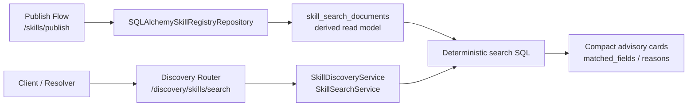
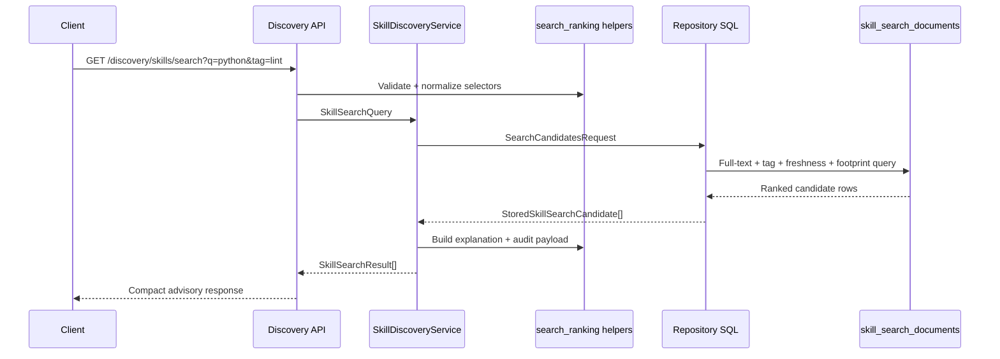

# Milestone 05 Changelog - Metadata Search and Ranking

This changelog documents implementation of [.agents/plans/05-metadata-search-ranking.md](/Users/yonatan/Dev/Aptitude/aptitude-server/.agents/plans/05-metadata-search-ranking.md).

## Scope Delivered

- Advisory discovery now ships on [app/interface/api/discovery.py](/Users/yonatan/Dev/Aptitude/aptitude-server/app/interface/api/discovery.py) as `GET /discovery/skills/search`, while [app/interface/api/skills.py](/Users/yonatan/Dev/Aptitude/aptitude-server/app/interface/api/skills.py) keeps a deprecated `GET /skills/search` compatibility wrapper with the same compact response shape.
- Search request and response contracts are formalized in [app/interface/dto/skills.py](/Users/yonatan/Dev/Aptitude/aptitude-server/app/interface/dto/skills.py) and [app/interface/dto/examples.py](/Users/yonatan/Dev/Aptitude/aptitude-server/app/interface/dto/examples.py), including selector validation, compact search cards, and explanation fields (`matched_fields`, `matched_tags`, `reasons`) for resolver-side advisory ranking.
- The search core is split between [app/core/skill_search.py](/Users/yonatan/Dev/Aptitude/aptitude-server/app/core/skill_search.py) and [app/intelligence/search_ranking.py](/Users/yonatan/Dev/Aptitude/aptitude-server/app/intelligence/search_ranking.py), which normalize free-text and tag inputs, derive explanation hints, and emit redacted audit metadata without moving final choice or dependency solving into the server.
- PostgreSQL-backed retrieval is implemented in [app/persistence/skill_registry_repository.py](/Users/yonatan/Dev/Aptitude/aptitude-server/app/persistence/skill_registry_repository.py) over the denormalized read model defined in [app/persistence/models/skill_search_document.py](/Users/yonatan/Dev/Aptitude/aptitude-server/app/persistence/models/skill_search_document.py). Ranking is deterministic, returns at most one version per `skill_id`, and orders ties by exact match, lexical score, tag overlap, usage count, publication time, artifact size, and stable identifiers.
- The schema and index rollout is delivered in [alembic/versions/0004_metadata_search_ranking.py](/Users/yonatan/Dev/Aptitude/aptitude-server/alembic/versions/0004_metadata_search_ranking.py), which creates `skill_search_documents`, installs GIN and scalar indexes, wires a trigger-maintained `tsvector`, and backfills existing immutable versions from manifest data.

## Architecture Snapshot

Why this shape:
- Search metadata is intentionally derived from immutable source-of-truth records instead of becoming a second mutable catalog. Publish-time indexing in [app/persistence/skill_registry_repository.py](/Users/yonatan/Dev/Aptitude/aptitude-server/app/persistence/skill_registry_repository.py) and migration backfill in [alembic/versions/0004_metadata_search_ranking.py](/Users/yonatan/Dev/Aptitude/aptitude-server/alembic/versions/0004_metadata_search_ranking.py) keep artifacts and manifests authoritative.
- Discovery stays isolated from fetch and resolution boundaries. [app/interface/api/discovery.py](/Users/yonatan/Dev/Aptitude/aptitude-server/app/interface/api/discovery.py), [app/interface/api/README.md](/Users/yonatan/Dev/Aptitude/aptitude-server/app/interface/api/README.md), and [app/main.py](/Users/yonatan/Dev/Aptitude/aptitude-server/app/main.py) make search a candidate-generation API, not a solver or final selector.

## Runtime Flow

## Design Notes

- The plan called for `GET /v1/skills/search`, but the shipped API follows the service split introduced in this codebase: the primary route is `GET /discovery/skills/search`, and [app/interface/api/skills.py](/Users/yonatan/Dev/Aptitude/aptitude-server/app/interface/api/skills.py) preserves `GET /skills/search` only as a deprecated compatibility wrapper.
- Ranking is deterministic at two levels in [app/persistence/skill_registry_repository.py](/Users/yonatan/Dev/Aptitude/aptitude-server/app/persistence/skill_registry_repository.py): first, `ROW_NUMBER()` picks one best immutable version per `skill_id`; second, the final `ORDER BY` chain makes equal-score candidates stable across repeated queries.
- `freshness_days` is computed at read time in [app/core/skill_search.py](/Users/yonatan/Dev/Aptitude/aptitude-server/app/core/skill_search.py) from `published_at`, and `footprint_bytes` is a response-level rename of stored `artifact_size_bytes`. This keeps the persistence model compact while still exposing filterable search metadata.
- `usage_count` is present in [app/persistence/models/skill_search_document.py](/Users/yonatan/Dev/Aptitude/aptitude-server/app/persistence/models/skill_search_document.py) and [app/interface/dto/skills.py](/Users/yonatan/Dev/Aptitude/aptitude-server/app/interface/dto/skills.py), but it currently backfills and persists as `0`. The ranking contract is ready for future signal ingestion without changing the HTTP shape.
- Search explanations are intentionally advisory, not authoritative. [app/intelligence/search_ranking.py](/Users/yonatan/Dev/Aptitude/aptitude-server/app/intelligence/search_ranking.py) only reports why a candidate matched; resolver-side reranking and final selection remain outside this service boundary.

## Schema Reference

Sources: [alembic/versions/0004_metadata_search_ranking.py](/Users/yonatan/Dev/Aptitude/aptitude-server/alembic/versions/0004_metadata_search_ranking.py), [app/persistence/models/skill_search_document.py](/Users/yonatan/Dev/Aptitude/aptitude-server/app/persistence/models/skill_search_document.py), and [app/interface/dto/skills.py](/Users/yonatan/Dev/Aptitude/aptitude-server/app/interface/dto/skills.py).

### `skill_search_documents`

| Field | Type | Nullable | Default / Constraint | Role |
| --- | --- | --- | --- | --- |
| `skill_version_fk` | `bigint` | No | PK, FK to `skill_versions.id`, `ON DELETE CASCADE` | Pins each search row to one immutable stored version so search indexing never becomes its own source of truth. |
| `skill_id` | `text` | No | Required | Preserves the external stable identifier returned to clients and used for per-skill collapsing. |
| `normalized_skill_id` | `text` | No | Indexed | Stores a lowercase normalized identifier for exact-match boosts and deterministic search comparisons. |
| `version` | `text` | No | Required | Records which immutable version produced the search document so the best matching version can be surfaced. |
| `name` | `text` | No | Required | Keeps the authored display name for compact search cards. |
| `normalized_name` | `text` | No | Indexed | Supports exact-name boosts and stable text normalization independent of display casing. |
| `description` | `text` | Yes | Optional | Carries searchable human-readable summary text without mutating the original manifest. |
| `tags` | `text[]` | No | Defaults to empty array | Preserves authored tag strings for API responses and backfill parity. |
| `normalized_tags` | `text[]` | No | Defaults to empty array, GIN indexed | Enables efficient all-tags-match filtering and normalized overlap counting. |
| `search_vector` | `tsvector` | No | Trigger-maintained, GIN indexed | Materializes weighted full-text search input over skill id, name, tags, and description. |
| `published_at` | `timestamptz` | No | Required | Supports freshness filters and deterministic recency tie-breaks. |
| `artifact_size_bytes` | `bigint` | No | Required | Provides the footprint filter and small-artifact tie-break without exposing storage internals. |
| `usage_count` | `bigint` | No | Defaults to `0` | Reserves a stable place for future popularity signals in the ranking chain. |
| `created_at` | `timestamptz` | No | Defaults to current timestamp | Records when the derived search document row was materialized. |

### `SkillSearchResultResponse`

| Field | Type | Nullable | Default / Constraint | Role |
| --- | --- | --- | --- | --- |
| `skill_id` | `string` | No | Required | Returns one stable candidate key per matched skill. |
| `version` | `string` | No | Required | Identifies the best immutable version selected for that skill by the ranking query. |
| `name` | `string` | No | Required | Gives the resolver a compact human-readable label without fetching the full manifest. |
| `description` | `string` | Yes | Optional | Supplies short context for advisory ranking and UX display. |
| `tags` | `string[]` | No | Required | Returns the matched version's searchable tags for downstream filtering or display. |
| `published_at` | `datetime` | No | Required UTC timestamp | Exposes recency directly so clients can reason about freshness. |
| `freshness_days` | `integer` | No | Derived at read time | Converts `published_at` into a compact age value for advisory scoring and UI hints. |
| `footprint_bytes` | `integer` | No | Derived from `artifact_size_bytes` | Exposes a compact storage-size signal without leaking file paths or artifact layout. |
| `usage_count` | `integer` | No | Currently `0` in persisted data | Reserves a future popularity signal while keeping the contract stable now. |
| `matched_fields` | `string[]` | No | Derived explanation | Tells clients which indexed fields contributed to the match. |
| `matched_tags` | `string[]` | No | Derived explanation | Shows which normalized requested tags were satisfied by the result. |
| `reasons` | `string[]` | No | Derived explanation | Provides stable advisory hints such as `text_match` or `tag_filter_match` without claiming final ranking authority. |

## Verification Notes

- Migration lifecycle and schema/index presence are covered by [tests/integration/test_migrations.py](/Users/yonatan/Dev/Aptitude/aptitude-server/tests/integration/test_migrations.py), including explicit backfill validation for `skill_search_documents`.
- Search endpoint behavior is covered in [tests/integration/test_skill_registry_endpoints.py](/Users/yonatan/Dev/Aptitude/aptitude-server/tests/integration/test_skill_registry_endpoints.py) for legacy/discovery parity, repeated tag and language filters, freshness and footprint filters, deterministic tie-breaks, and selector-required validation.
- Pure normalization, explanation, and audit redaction logic is covered by [tests/unit/test_search_ranking.py](/Users/yonatan/Dev/Aptitude/aptitude-server/tests/unit/test_search_ranking.py).
- Example payload drift is covered by [tests/unit/test_api_contract_examples.py](/Users/yonatan/Dev/Aptitude/aptitude-server/tests/unit/test_api_contract_examples.py), which validates the committed search success example against the DTO contract.
- Integration coverage still depends on a reachable PostgreSQL database via [tests/conftest.py](/Users/yonatan/Dev/Aptitude/aptitude-server/tests/conftest.py); this milestone does not add a database-free end-to-end search harness.
