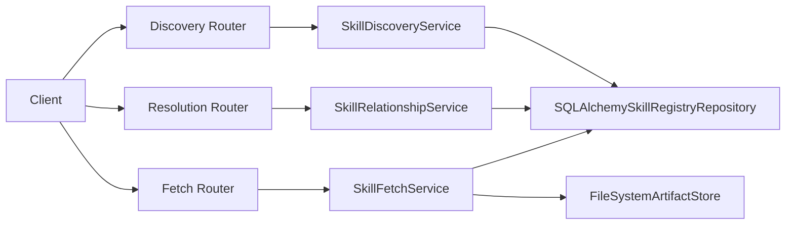
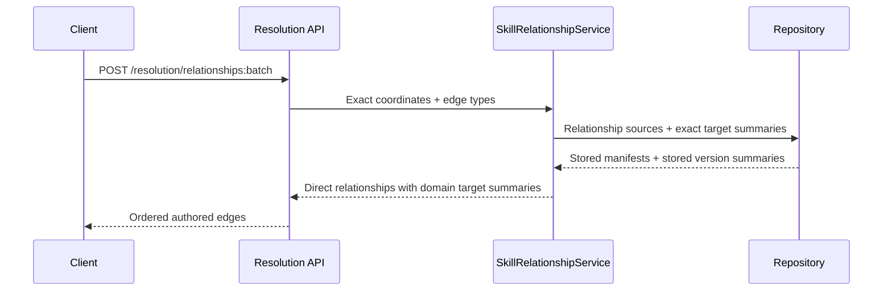

# Milestone 11 Changelog - Discovery / Resolution / Fetch Service Split

This changelog documents implementation of [.agents/plans/11-discovery-resolution-fetch-service-split.md](/Users/yonatan/Dev/Aptitude/aptitude-server/.agents/plans/11-discovery-resolution-fetch-service-split.md).

## Scope Delivered

- Split read-side APIs are exposed through [app/interface/api/discovery.py](/Users/yonatan/Dev/Aptitude/aptitude-server/app/interface/api/discovery.py), [app/interface/api/resolution.py](/Users/yonatan/Dev/Aptitude/aptitude-server/app/interface/api/resolution.py), and [app/interface/api/fetch.py](/Users/yonatan/Dev/Aptitude/aptitude-server/app/interface/api/fetch.py), while [app/interface/api/skills.py](/Users/yonatan/Dev/Aptitude/aptitude-server/app/interface/api/skills.py) keeps deprecated legacy discovery and combined fetch compatibility routes.
- Core read behavior is separated into [app/core/skill_discovery.py](/Users/yonatan/Dev/Aptitude/aptitude-server/app/core/skill_discovery.py), [app/core/skill_relationships.py](/Users/yonatan/Dev/Aptitude/aptitude-server/app/core/skill_relationships.py), and [app/core/skill_fetch.py](/Users/yonatan/Dev/Aptitude/aptitude-server/app/core/skill_fetch.py), with request-scoped wiring in [app/core/dependencies.py](/Users/yonatan/Dev/Aptitude/aptitude-server/app/core/dependencies.py) and composition in [app/main.py](/Users/yonatan/Dev/Aptitude/aptitude-server/app/main.py).
- HTTP contracts for batch fetch, relationship reads, and compact discovery responses are formalized in [app/interface/dto/skills.py](/Users/yonatan/Dev/Aptitude/aptitude-server/app/interface/dto/skills.py) and example payloads in [app/interface/dto/examples.py](/Users/yonatan/Dev/Aptitude/aptitude-server/app/interface/dto/examples.py).
- Persistence stays data-local through [app/persistence/skill_registry_repository.py](/Users/yonatan/Dev/Aptitude/aptitude-server/app/persistence/skill_registry_repository.py) plus [app/persistence/artifact_store.py](/Users/yonatan/Dev/Aptitude/aptitude-server/app/persistence/artifact_store.py), preserving ordered batch reads, exact immutable version lookups, direct authored relationship sources, and checksum-verified artifact streaming.
- Follow-up hardening work tightened typed boundaries without changing behavior: [app/core/skill_registry.py](/Users/yonatan/Dev/Aptitude/aptitude-server/app/core/skill_registry.py), [app/core/skill_relationships.py](/Users/yonatan/Dev/Aptitude/aptitude-server/app/core/skill_relationships.py), [app/interface/api/discovery.py](/Users/yonatan/Dev/Aptitude/aptitude-server/app/interface/api/discovery.py), and [app/interface/api/skills.py](/Users/yonatan/Dev/Aptitude/aptitude-server/app/interface/api/skills.py) now share domain summary conversion, use literal relationship edge types, and keep injected discovery services non-optional.

## Architecture Snapshot

Why this shape:
- The split keeps discovery advisory, resolution direct-only, and fetch exact-only, which protects the server/client boundary described by [app/main.py](/Users/yonatan/Dev/Aptitude/aptitude-server/app/main.py) and the route contracts in [app/interface/api/README.md](/Users/yonatan/Dev/Aptitude/aptitude-server/app/interface/api/README.md).
- Follow-up type hardening stays inside the core/interface boundary instead of changing persistence ports. [app/core/skill_registry.py](/Users/yonatan/Dev/Aptitude/aptitude-server/app/core/skill_registry.py) converts stored summaries into domain summaries, while [app/core/ports.py](/Users/yonatan/Dev/Aptitude/aptitude-server/app/core/ports.py) remains persistence-facing.

## Runtime Flow

## Design Notes

- Deprecated legacy routes remain in place as compatibility wrappers instead of being removed immediately. See [app/interface/api/skills.py](/Users/yonatan/Dev/Aptitude/aptitude-server/app/interface/api/skills.py), [tests/integration/test_skill_registry_endpoints.py](/Users/yonatan/Dev/Aptitude/aptitude-server/tests/integration/test_skill_registry_endpoints.py), and [tests/unit/test_registry_api_boundary.py](/Users/yonatan/Dev/Aptitude/aptitude-server/tests/unit/test_registry_api_boundary.py).
- Direct relationship reads intentionally preserve authored manifest order and only expose `depends_on` and `extends`. The route and core service do not perform transitive expansion or version solving. See [app/interface/api/resolution.py](/Users/yonatan/Dev/Aptitude/aptitude-server/app/interface/api/resolution.py) and [app/core/skill_relationships.py](/Users/yonatan/Dev/Aptitude/aptitude-server/app/core/skill_relationships.py).
- The follow-up typing pass treated internal type drift as milestone maintenance instead of inventing a new plan. The service behavior is unchanged, but the code now rejects persistence/domain summary mixing earlier through mypy and unit coverage. See [tests/unit/test_skill_relationship_service.py](/Users/yonatan/Dev/Aptitude/aptitude-server/tests/unit/test_skill_relationship_service.py) and [tests/unit/test_skill_manifest.py](/Users/yonatan/Dev/Aptitude/aptitude-server/tests/unit/test_skill_manifest.py).

## Schema Reference

Sources: [app/interface/dto/skills.py](/Users/yonatan/Dev/Aptitude/aptitude-server/app/interface/dto/skills.py), [app/core/skill_relationships.py](/Users/yonatan/Dev/Aptitude/aptitude-server/app/core/skill_relationships.py), and [app/core/skill_fetch.py](/Users/yonatan/Dev/Aptitude/aptitude-server/app/core/skill_fetch.py).

### `SkillRelationshipBatchRequest`

| Field | Type | Nullable | Default / Constraint | Role |
| --- | --- | --- | --- | --- |
| `coordinates` | `list[ExactSkillCoordinateRequest]` | No | 1 to 100 items | Preserves request order for direct relationship inspection over exact immutable source versions. |
| `edge_types` | `list[Literal["depends_on", "extends"]]` | No | Defaults to both edge types | Lets clients narrow the relationship families without opening the door to solver-only edge kinds. |

### `SkillRelationship`

| Field | Type | Nullable | Default / Constraint | Role |
| --- | --- | --- | --- | --- |
| `edge_type` | `Literal["depends_on", "extends"]` | No | Required | Keeps the core representation aligned with the public API contract and blocks unsupported edge values. |
| `selector` | `SkillRelationshipSelector` | No | Required | Preserves the exact authored selector from the stored manifest, including constraints and markers. |
| `target_version` | `SkillVersionSummary` | Yes | Present only for exact selectors | Carries a domain-level exact target summary when the authored selector points to a concrete immutable version. |

### `SkillFetchBatchItem`

| Field | Type | Nullable | Default / Constraint | Role |
| --- | --- | --- | --- | --- |
| `coordinate` | `ExactSkillCoordinate` | No | Required | Echoes the exact request key so ordered batch results remain stable. |
| `version` | `SkillVersionSummary` | Yes | `None` when not found | Returns the immutable metadata projection without inlining artifact bytes. |

## Verification Notes

- End-to-end behavior is covered in [tests/integration/test_skill_registry_endpoints.py](/Users/yonatan/Dev/Aptitude/aptitude-server/tests/integration/test_skill_registry_endpoints.py) for metadata fetch, artifact streaming, ordered batch fetch, direct relationship reads, and discovery parity.
- Contract and path boundaries are covered by [tests/unit/test_registry_api_boundary.py](/Users/yonatan/Dev/Aptitude/aptitude-server/tests/unit/test_registry_api_boundary.py) and [tests/unit/test_openapi_contract.py](/Users/yonatan/Dev/Aptitude/aptitude-server/tests/unit/test_openapi_contract.py).
- Follow-up type hardening is verified by [tests/unit/test_skill_manifest.py](/Users/yonatan/Dev/Aptitude/aptitude-server/tests/unit/test_skill_manifest.py), [tests/unit/test_skill_relationship_service.py](/Users/yonatan/Dev/Aptitude/aptitude-server/tests/unit/test_skill_relationship_service.py), and the Makefile quality gates `make lint`, `make typecheck`, and `make test`.
- Integration execution still depends on a reachable PostgreSQL database through [tests/conftest.py](/Users/yonatan/Dev/Aptitude/aptitude-server/tests/conftest.py); when the database is unavailable, the integration route checks are skipped rather than rewritten as fake end-to-end tests.
