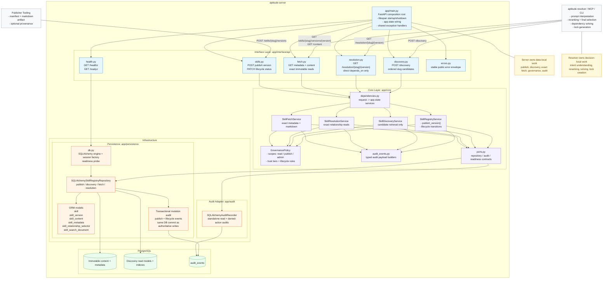

# Aptitude Server Architecture

```mermaid
flowchart TB

    Publisher["Publisher Tooling<br/>- manifest + markdown artifact<br/>- optional provenance"]
    Resolver["aptitude-resolver / MCP / CLI<br/>- prompt interpretation<br/>- reranking + final selection<br/>- dependency solving<br/>- lock generation"]

    subgraph Server["aptitude-server"]
        Main["app/main.py<br/>FastAPI composition root<br/>- lifespan startup/shutdown<br/>- app.state wiring<br/>- shared exception handlers"]

        subgraph Interface["Interface Layer: app/interface/api"]
            Health["health.py<br/>GET /healthz<br/>GET /readyz"]
            DiscoveryRoute["discovery.py<br/>POST /discovery<br/>ordered slug candidates"]
            ResolutionRoute["resolution.py<br/>GET /resolution/{slug}/{version}<br/>direct depends_on only"]
            FetchRoute["fetch.py<br/>GET metadata + content<br/>exact immutable reads"]
            SkillsRoute["skills.py<br/>POST publish version<br/>PATCH lifecycle status"]
            ErrorRoute["errors.py<br/>stable public error envelope"]
        end

        subgraph Core["Core Layer: app/core"]
            Dependencies["dependencies.py<br/>request -> app.state services"]
            RegistrySvc["SkillRegistryService<br/>- publish_version()<br/>- lifecycle transitions"]
            DiscoverySvc["SkillDiscoveryService<br/>candidate retrieval only"]
            ResolutionSvc["SkillResolutionService<br/>exact relationship reads"]
            FetchSvc["SkillFetchService<br/>exact metadata + markdown"]
            Governance["GovernancePolicy<br/>- scopes: read / publish / admin<br/>- trust tiers + lifecycle rules"]
            AuditEvents["audit_events.py<br/>typed audit payload builders"]
            Ports["ports.py<br/>repository / audit / readiness contracts"]
        end

        subgraph Infra["Infrastructure"]
            subgraph Persistence["Persistence: app/persistence"]
                DB["db.py<br/>SQLAlchemy engine + session factory<br/>readiness probe"]
                Repo["SQLAlchemySkillRegistryRepository<br/>publish / discovery / fetch / resolution"]
                Models["ORM models<br/>skill<br/>skill_version<br/>skill_content<br/>skill_metadata<br/>skill_relationship_selector<br/>skill_search_document"]
                TxAudit["Transactional mutation audit<br/>publish + lifecycle events<br/>same DB commit as authoritative writes"]
            end

            subgraph Audit["Audit Adapter: app/audit"]
                AuditRecorder["SQLAlchemyAuditRecorder<br/>standalone read + denied-action audits"]
            end
        end

        subgraph Data["PostgreSQL"]
            ArtifactStore[("Immutable content + metadata")]
            SearchIndex[("Discovery read models + indexes")]
            AuditTable[("audit_events")]
        end
    end

    Publisher -->|"POST /skills/{slug}/versions"| SkillsRoute
    Resolver -->|"POST /discovery"| DiscoveryRoute
    Resolver -->|"GET /resolution/{slug}/{version}"| ResolutionRoute
    Resolver -->|"GET /skills/{slug}/versions/{version}<br/>GET /content"| FetchRoute

    Main --> Health
    Main --> DiscoveryRoute
    Main --> ResolutionRoute
    Main --> FetchRoute
    Main --> SkillsRoute
    Main --> ErrorRoute

    DiscoveryRoute --> Dependencies
    ResolutionRoute --> Dependencies
    FetchRoute --> Dependencies
    SkillsRoute --> Dependencies
    Health --> DB

    Dependencies --> RegistrySvc
    Dependencies --> DiscoverySvc
    Dependencies --> ResolutionSvc
    Dependencies --> FetchSvc

    RegistrySvc --> Governance
    DiscoverySvc --> Governance
    ResolutionSvc --> Governance
    FetchSvc --> Governance

    RegistrySvc --> AuditEvents
    DiscoverySvc --> AuditEvents
    ResolutionSvc --> AuditEvents
    FetchSvc --> AuditEvents

    RegistrySvc --> Ports
    DiscoverySvc --> Ports
    ResolutionSvc --> Ports
    FetchSvc --> Ports

    Ports --> Repo
    Ports --> AuditRecorder
    DB --> Repo
    Repo --> Models
    Repo --> TxAudit
    Repo --> ArtifactStore
    Repo --> SearchIndex
    TxAudit --> AuditTable

    AuditRecorder --> AuditTable

    NoteServer["Server owns data-local work<br/>publish, discovery, exact fetch, governance, audit"]
    NoteResolver["Resolver owns decision-local work<br/>intent understanding, reranking, solving, lock creation"]

    Main --- NoteServer
    Resolver --- NoteResolver

    classDef edge fill:#ffffff,stroke:#adb5bd,color:#495057,stroke-dasharray: 4 4;
    classDef external fill:#f8f9fa,stroke:#868e96,color:#1e1e1e;
    classDef entry fill:#e7f5ff,stroke:#1971c2,color:#1e1e1e;
    classDef core fill:#f3f0ff,stroke:#6741d9,color:#1e1e1e;
    classDef infra fill:#fff4e6,stroke:#e8590c,color:#1e1e1e;
    classDef data fill:#ebfbee,stroke:#2f9e44,color:#1e1e1e;
    classDef note fill:#fff9db,stroke:#f08c00,color:#5f3b00;

    class Publisher,Resolver external;
    class Main,Health,DiscoveryRoute,ResolutionRoute,FetchRoute,SkillsRoute,ErrorRoute entry;
    class Dependencies,RegistrySvc,DiscoverySvc,ResolutionSvc,FetchSvc,Governance,AuditEvents,Ports core;
    class DB,Repo,Models,TxAudit,AuditRecorder infra;
    class ArtifactStore,SearchIndex,AuditTable data;
    class NoteServer,NoteResolver note;
```
