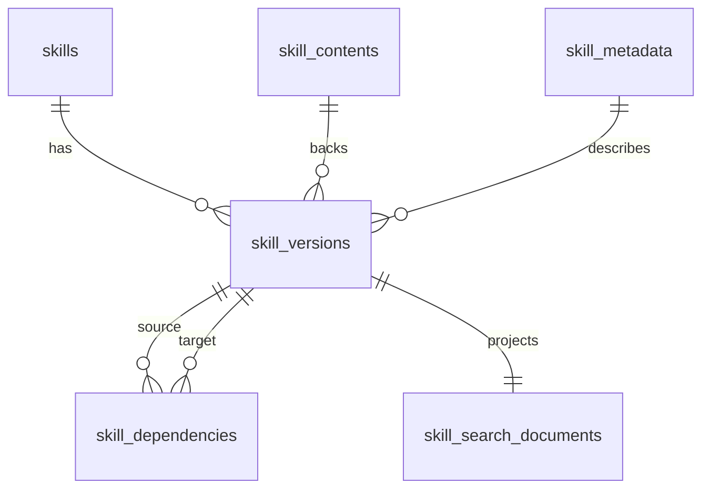

# Database Schema

## Purpose
This document is the canonical target schema for the registry data model.

It reflects the direction implied by the current plans:

- PostgreSQL is the only authoritative store
- versions are immutable
- discovery queries stay body-free
- markdown bodies are stored as `text`
- identity, versioning, body, query metadata, and graph edges are modeled separately

## Current Review
The live schema today still mixes too many concerns:

- `skills` stores the logical skill identifier only
- `skill_versions` stores both version identity and a large `manifest_json`
- dependency/search tables are derived from `manifest_json`
- artifact fetch still depends on filesystem-relative paths

That model is enough for the current MVP, but it is not the clean long-term source model for normalized metadata search and PostgreSQL-native body storage.

## Design Principles
- Keep `skills` as the stable identity row.
- Keep `skill_versions` immutable after publish.
- Store authored markdown in `skill_contents.raw_markdown` as PostgreSQL `text`.
- Keep high-cardinality filters and ranking fields in typed columns.
- Use `jsonb` only for flexible structured metadata.
- Keep discovery/list/search APIs off the raw body table by default.
- Keep search read models derived and rebuildable.

## TOAST Guidance
Use PostgreSQL TOAST implicitly through normal `text` storage.

- `skill_contents.raw_markdown` should be `text`
- do not use large objects, blobs, or `jsonb` for markdown
- default Postgres storage behavior is sufficient to start
- only consider `SET STORAGE EXTERNAL` after profiling substring-heavy access patterns

The main optimization is not manual TOAST tuning. It is query-path separation so metadata-heavy reads never touch large text columns unless exact content is requested.

## Entity Overview

## Tables

### `skills`
Stable identity and lifecycle state.

| Column | Type | Constraints | Purpose |
| --- | --- | --- | --- |
| `id` | `bigint` | PK | Internal identity key |
| `slug` | `text` | `NOT NULL`, unique | Stable public skill identifier |
| `current_version_id` | `bigint` | nullable FK -> `skill_versions.id` | Mutable pointer to the latest/default published version |
| `created_at` | `timestamptz` | `NOT NULL` | Row creation time |
| `updated_at` | `timestamptz` | `NOT NULL` | Last identity-state update |
| `status` | `text` | `NOT NULL` | Lifecycle state such as `draft`, `published`, `deprecated`, `archived` |

Recommended constraints and indexes:

- unique index on `slug`
- index on `(status, updated_at DESC)` if lifecycle filtering becomes common
- repository-level invariant that `current_version_id`, when present, belongs to the same skill

### `skill_versions`
Immutable version rows binding identity, content, and metadata together.

| Column | Type | Constraints | Purpose |
| --- | --- | --- | --- |
| `id` | `bigint` | PK | Internal immutable version key |
| `skill_id` | `bigint` | `NOT NULL`, FK -> `skills.id` | Parent skill identity |
| `version` | `text` | `NOT NULL` | Semantic version string |
| `content_id` | `bigint` | `NOT NULL`, FK -> `skill_contents.id` | Immutable body row |
| `metadata_id` | `bigint` | `NOT NULL`, FK -> `skill_metadata.id` | Immutable metadata row |
| `checksum` | `text` | `NOT NULL` | Version-level digest for integrity and caching |
| `created_at` | `timestamptz` | `NOT NULL` | Insert time |
| `published_at` | `timestamptz` | nullable | Publish timestamp |
| `is_published` | `boolean` | `NOT NULL` | Publication state |

Recommended constraints and indexes:

- unique index on `(skill_id, version)`
- index on `(is_published, published_at DESC)`
- indexes on `content_id` and `metadata_id`
- optional index on `checksum` if used as a fetch/cache key

Immutability rule:

- once `is_published = true`, treat the row as write-once
- any body or metadata change creates a new `skill_versions` row

### `skill_contents`
Authoritative markdown body storage.

| Column | Type | Constraints | Purpose |
| --- | --- | --- | --- |
| `id` | `bigint` | PK | Internal content key |
| `raw_markdown` | `text` | `NOT NULL` | Canonical skill markdown body |
| `rendered_summary` | `text` | nullable | Optional pre-rendered short summary |
| `storage_size_bytes` | `bigint` | nullable | Observed body size for planning and diagnostics |
| `checksum` | `text` | `NOT NULL`, unique | Content digest for deduplication and integrity |

Storage notes:

- `raw_markdown` is toastable `text`
- exact body fetches read this table directly
- list/search/rank queries should not join this table unless explicitly needed

### `skill_metadata`
Structured, queryable metadata for discovery and ranking.

| Column | Type | Constraints | Purpose |
| --- | --- | --- | --- |
| `id` | `bigint` | PK | Internal metadata key |
| `name` | `text` | `NOT NULL` | Display name |
| `description` | `text` | nullable | Searchable short description |
| `tags` | `text[]` | nullable or default empty | Primary categorical filters |
| `headers` | `jsonb` | nullable | Flexible header-like attributes |
| `inputs_schema` | `jsonb` | nullable | Structured input contract |
| `outputs_schema` | `jsonb` | nullable | Structured output contract |
| `token_estimate` | `integer` | nullable | Approximate token footprint |
| `maturity_score` | `numeric` | nullable | Quality/stability ranking input |
| `security_score` | `numeric` | nullable | Security/trust ranking input |

Recommended constraints and indexes:

- GIN index on `tags` when kept as `text[]`
- GIN index on `headers` only if containment queries are real
- B-tree indexes on `token_estimate`, `maturity_score`, and `security_score` if those fields are used in filters or deterministic ranking

Modeling rule:

- use typed columns first for fields frequently filtered or sorted
- keep `jsonb` for evolving structures, not as the main metadata dump

### `skill_dependencies`
Graph edges between immutable versions.

| Column | Type | Constraints | Purpose |
| --- | --- | --- | --- |
| `from_version_id` | `bigint` | `NOT NULL`, FK -> `skill_versions.id` | Source version |
| `to_version_id` | `bigint` | `NOT NULL`, FK -> `skill_versions.id` | Target version |
| `constraint_type` | `text` | `NOT NULL` | `depends_on`, `extends`, `conflicts_with`, `overlaps_with` |
| `version_constraint` | `text` | nullable | Original authored selector text or compatibility note |

Recommended constraints and indexes:

- composite PK or unique constraint on `(from_version_id, to_version_id, constraint_type)`
- index on `from_version_id`
- index on `to_version_id`
- check constraint restricting `constraint_type` to the supported set

Important note:

- this table assumes graph edges resolve to concrete immutable versions
- if the product must preserve selector-only dependencies before resolution, add one extra target identity field or a small side table instead of collapsing that information back into `jsonb`

### `skill_search_documents`
Derived read model for fast advisory search.

This table is optional but recommended when discovery load grows. It should stay derived from `skills`, `skill_versions`, and `skill_metadata`.

Suggested fields:

| Column | Type | Purpose |
| --- | --- | --- |
| `skill_version_id` | `bigint` | PK and FK to `skill_versions.id` |
| `slug` | `text` | Normalized identifier for direct matching |
| `version` | `text` | Candidate version |
| `name` | `text` | Display name |
| `description` | `text` | Searchable summary |
| `tags` | `text[]` | Search filters |
| `published_at` | `timestamptz` | Freshness ranking input |
| `token_estimate` | `integer` | Ranking/filtering input |
| `maturity_score` | `numeric` | Ranking input |
| `security_score` | `numeric` | Ranking input |
| `search_vector` | `tsvector` | Full-text index target |

Recommended indexes:

- GIN on `search_vector`
- GIN on `tags`
- B-tree on `slug`
- B-tree on `published_at`

Rule:

- do not store `raw_markdown` in this table

## Query Path Separation
The schema is intentionally optimized around two read paths.

Discovery path:

- hit `skills`
- hit `skill_versions`
- hit `skill_metadata`
- optionally hit `skill_search_documents`
- do not hit `skill_contents`

Exact fetch path:

- resolve `(slug, version)` through `skills` and `skill_versions`
- load `skill_contents.raw_markdown`
- verify checksum from `skill_versions.checksum` and/or `skill_contents.checksum`

## Migration Direction from the Current Schema
Current tables:

- `skills`
- `skill_versions`
- `skill_version_checksums`
- `skill_relationship_edges`
- `skill_search_documents`

Suggested migration sequence:

1. Add `skill_contents` and `skill_metadata`.
2. Backfill rows from `skill_versions.manifest_json`.
3. Add normalized foreign keys from `skill_versions` to content and metadata.
4. Replace filesystem `artifact_rel_path` reads with PostgreSQL content reads.
5. Replace or refactor `skill_relationship_edges` into `skill_dependencies`.
6. Rebuild `skill_search_documents` from normalized sources.
7. Remove obsolete mixed-source columns once the API layer is migrated.

## Non-Goals
- storing markdown in `jsonb`
- using Postgres large objects for `skill.md`
- joining the content table for every search/list request
- making derived search tables the source of truth
