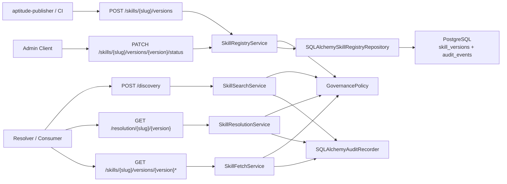

# Milestone 10 Changelog - Governance, Provenance, and Audit Completion

This changelog documents implementation of [.agents/plans/10-governance-provenance-and-audit-completion.md](../../.agents/plans/10-governance-provenance-and-audit-completion.md).

The milestone finishes the governance layer on top of the frozen publish/discovery/resolution/exact-fetch contract. Advisory provenance is now aligned to the publisher/server/resolver boundary, exact-read auditing is complete, and successful mutation audits commit in the same transaction as the authoritative PostgreSQL write.

## Scope Delivered

- Publisher-collected provenance now supports optional `publisher_identity`, while the server remains authoritative for provenance normalization, validation, persistence, trust-tier enforcement, and derived trust context: [app/core/governance.py](../../app/core/governance.py), [app/core/skill_registry.py](../../app/core/skill_registry.py), [app/interface/dto/skills.py](../../app/interface/dto/skills.py), [app/interface/api/skill_api_support.py](../../app/interface/api/skill_api_support.py).
- Immutable version rows now store the full advisory provenance snapshot needed for exact metadata reads, including `publisher_identity` and `policy_profile_at_publish`: [alembic/versions/0001_initial_schema.py](../../alembic/versions/0001_initial_schema.py), [app/persistence/models/skill_version.py](../../app/persistence/models/skill_version.py), [app/persistence/skill_registry_repository.py](../../app/persistence/skill_registry_repository.py).
- Exact metadata fetch now returns enriched advisory provenance with server-derived `trust_context`, while discovery, resolution, and raw markdown content fetch remain provenance-independent: [app/core/skill_fetch.py](../../app/core/skill_fetch.py), [app/core/skill_resolution.py](../../app/core/skill_resolution.py), [docs/api-contract.md](../../docs/api-contract.md).
- Audit coverage now spans successful and denied publish, successful and denied lifecycle updates, discovery activity, exact resolution/metadata/content reads, and denied exact reads for hidden lifecycle states. Successful publish and lifecycle audits are committed transactionally with the mutation: [app/core/audit_events.py](../../app/core/audit_events.py), [app/audit/recorder.py](../../app/audit/recorder.py), [app/persistence/models/audit_event.py](../../app/persistence/models/audit_event.py).
- Docs and module READMEs now explicitly describe the publisher/server/resolver provenance split and the advisory-only nature of provenance on read paths: [docs/overview.md](../../docs/overview.md), [docs/prd.md](../../docs/prd.md), [docs/schema.md](../../docs/schema.md), [app/interface/api/README.md](../../app/interface/api/README.md).

## Architecture Snapshot

## Design Notes

- Provenance stays advisory and publisher-supplied. The server does not invent a richer authenticated publisher principal in this milestone; that remains future auth-boundary work.
- `trust_context` is server-derived from immutable `trust_tier` plus the active policy profile captured at publish time. Clients cannot submit or override it.
- Discovery, resolution, and raw content fetch still operate only on canonical PostgreSQL state and ignore provenance entirely.
- Mutation audit rows now share the same database transaction as the publish or lifecycle write so authoritative state and mutation audit cannot drift on partial commit.

## Verification Notes

- Unit coverage now includes provenance normalization/validation, audit-event builders, DTO example compatibility, fetch/resolution audit behavior, and the stale duplicate-publish regression: [tests/unit/test_governance.py](../../tests/unit/test_governance.py), [tests/unit/test_audit_events.py](../../tests/unit/test_audit_events.py), [tests/unit/test_skill_registry_service.py](../../tests/unit/test_skill_registry_service.py), [tests/unit/test_skill_fetch_service.py](../../tests/unit/test_skill_fetch_service.py), [tests/unit/test_skill_resolution_service.py](../../tests/unit/test_skill_resolution_service.py), [tests/unit/test_api_contract_examples.py](../../tests/unit/test_api_contract_examples.py).
- PostgreSQL integration coverage now asserts the enriched provenance response and the audit event matrix: [tests/integration/test_skill_registry_endpoints.py](../../tests/integration/test_skill_registry_endpoints.py), [tests/integration/test_migrations.py](../../tests/integration/test_migrations.py).
- Verification commands run for this milestone:
  - `uv run ruff check app tests alembic`
  - `uv run pytest tests/unit -q`
  - `uv run pytest tests/integration/test_skill_registry_endpoints.py tests/integration/test_migrations.py -q`
